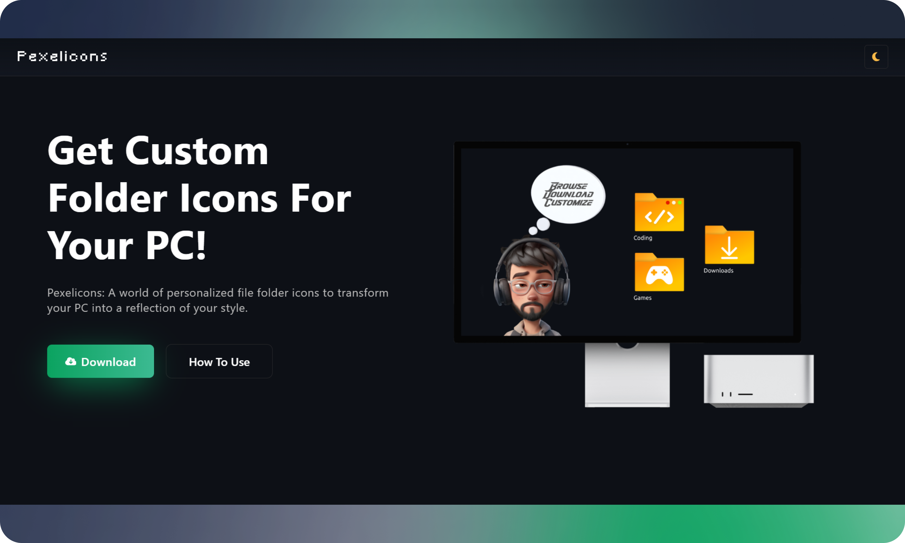

# <a href="https://vinodjangid07.github.io/Pexelicons" target="_blank">Pexelicons</a>

Pexelicons is a website that offers custom folder icons for Windows, allowing users to personalize their PC by changing the default folder icons to match their style preferences.

## Features

- 🎨 **Custom Icons:** Explore a world of personalized file folder icons inspired by various themes.
- 🚀 **Easy to Use:** Download and apply custom icons to your folders effortlessly.
- 💻 **Compatibility:** Icons are provided in ICO format, ensuring compatibility with Windows systems.

## Table of Contents

- [Getting Started](#getting-started)
  - [Download Icons](#download-icons)
  - [How to Use](#how-to-use)
- [Contributing](#contributing)
- [License](#license)
- [Contact](#contact)

## Getting Started

### Download Icons

Visit the [Pexelicons Website](https://vinodjangid07.github.io/Pexelicons) to download custom folder icons for your PC.

### How to Use

Follow these steps to apply custom icons to your folders:

1. **Download a Custom Icon:** Download a custom icon (ICO file) that you want to use for your folder. Icons are provided in ICO format, ensuring compatibility with Windows systems.
2. **Copy the ICO File to the Folder:** Copy the custom ICO file to the folder for which you want to change the icon.
3. **Right-click on the Folder:** Right-click on the folder, and select "Properties" from the context menu.
4. **Go to the "Customize" Tab:** In the folder properties window, go to the "Customize" tab.
5. **Click on "Change Icon":** Look for the "Change Icon" button and click on it.
6. **Browse for the Custom ICO File:** Browse to the location where you copied the custom ICO file and select it.
7. **Apply and OK:** Apply the changes, and then click "OK" to close the properties window.

## Contributing

If you'd like to contribute to Pexelicons, feel free to open an issue or submit a pull request. Your contributions are highly appreciated!

## License

This project is licensed under the [MIT License](LICENSE).

## Contact

- For inquiries, contact infovinodjangid@gmail.com

---

Design & Built by <a href="https://github.com/vinodjangid07">@Vinodjangid07</a> | &copy; twentytwentyfour

